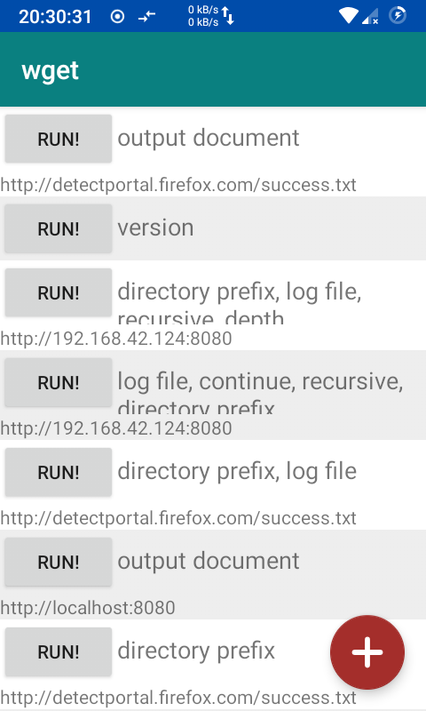
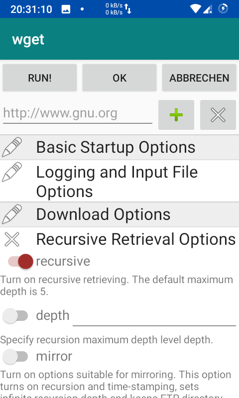
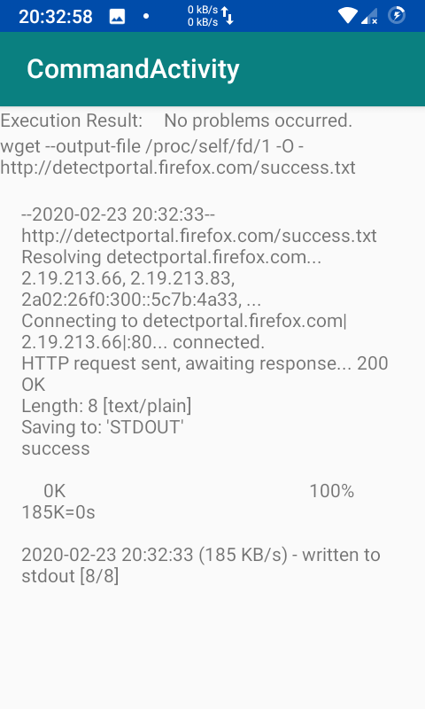

# wget for Android

Android App to download and mirror web pages using the GNU Wget command.

  

## Development

This app is developed with [Android Studio](https://developer.android.com/studio/).

## Credits

- [pelya/wget-android](https://github.com/pelya/wget-android)
- [wget](http://www.gnu.org/software/wget/)

